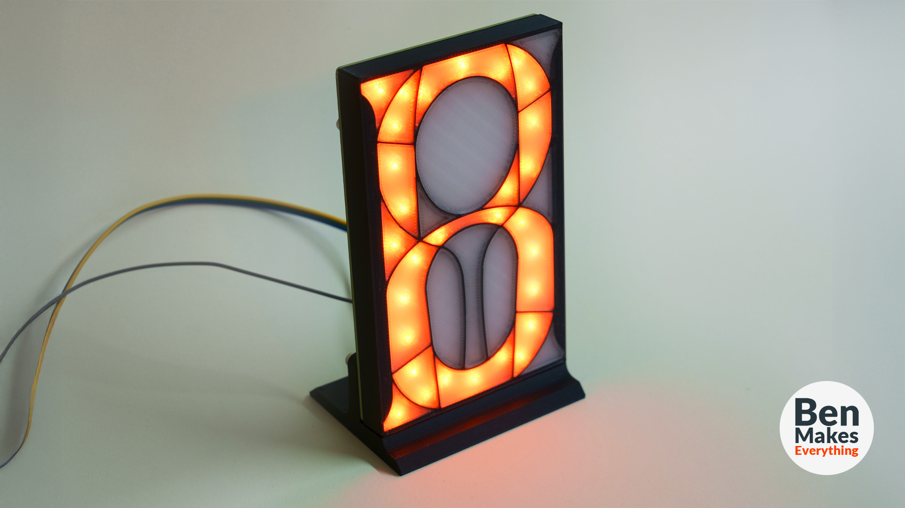

# 3D Printable 20 Segment Display
### This is a fully 3D printed segmented display designed for use with 5mm LEDs
You can use any type, but it was designed to be used in conjunction with the WS2812 through-hole type, soldered to a custom PCB.

# Parts list - for 1 display
* (38) WS2812 5mm LED: https://www.aliexpress.us/item/3256803179127817.html
* (1) 10uF capacitor
* (2) 1x3 male pin headers
* (1) PCB
* (4) M3 heat-set threaded inserts

All of the 3D files are available in .stl and .step format in the "Objects" folder.

The Arduino code for this version is available in the "Code" folder. It requires that you install the Adafruit neopixel library within the Arduino IDE. 

In the "PCBs" folder you will find 2 zip files. 20-Segment-THT-KiCad.zip is a zipped folder of everything you need to open this in KiCad version 8+. 20-Segment-THT.kicad_pcb.zip contains gerber/drill files. Please note, the BOM file was auto generated, but I did not use it in getting these manufactured and can't confirm that the info is correct. I manually soldered the parts myself so if you want to get these manufactured in complete form, you'll likely need to specify the part numbers yourself.

The KiCad symbols and footprints for the WS2812 were based on these, created by bitluni: (https://github.com/bitluni/magnetMatrix6x6).
